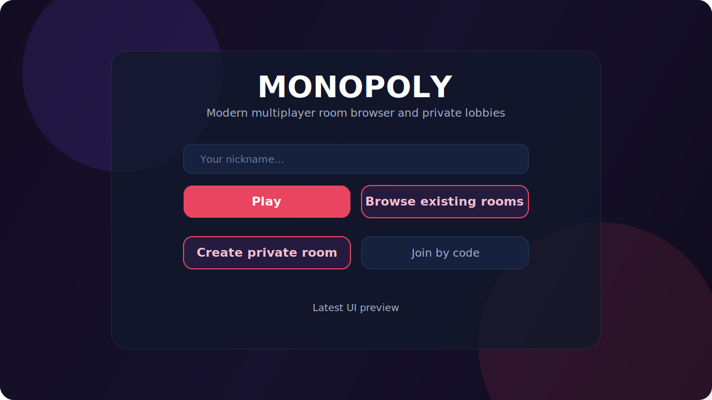
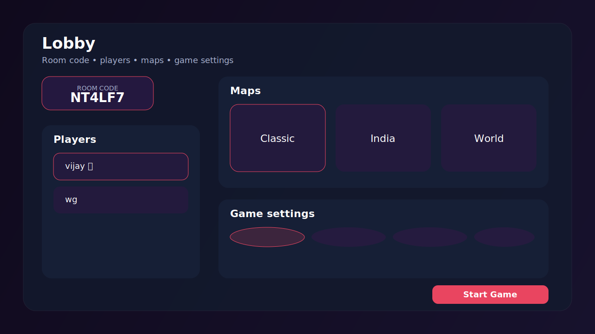
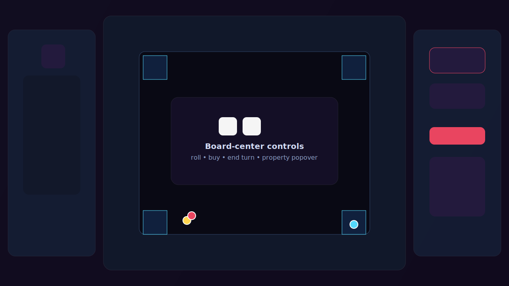
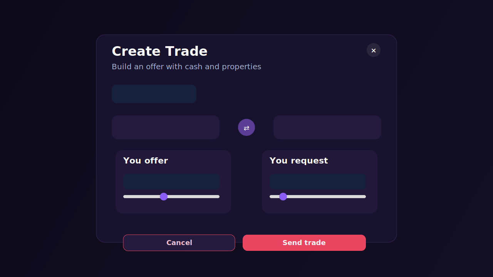
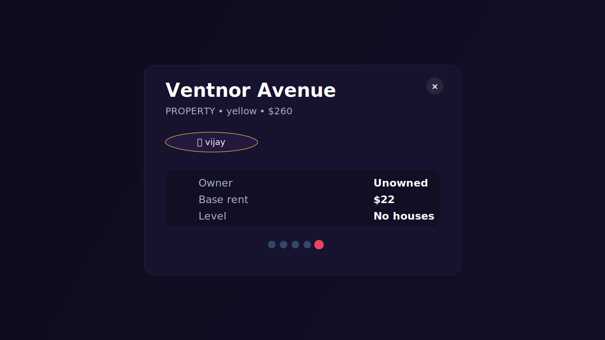

# 🎲 Monopoly Online — Multiplayer Board Game

A real-time multiplayer Monopoly-style web application built with **Next.js**, **Socket.IO**, **Prisma**, and **SQLite**. Create rooms, invite friends, and play the classic board game online.

> Inspired by [richup.io](https://richup.io)

---

## 📸 Latest UI Gallery

### Modern Home — Play, Browse Rooms, or Create Private Room


### Modern Lobby — Room Sharing, Map Selection, and Game Rules


### Glass Game Board — Board-Center Controls and Player Panels


### Trade Composer — Cash and Property Exchange UI


### Property Popover — Upgrade, Downgrade, Mortgage, and Tile Details


---

## ✨ Features

| Feature | Description |
|---------|-------------|
| **Public + Private Rooms** | Start a quick public game, browse existing rooms, or create a private invite-only room |
| **Modern Lobby Controls** | Share room links, view players, preview maps, and configure game settings before start |
| **3 Playable Maps** | Classic, India, and World boards are included out of the box |
| **Board-Center Gameplay** | Roll dice, buy, pay rent, and end turns from the center of the board for better usability |
| **Property Popover UI** | Click any tile to view owner, rent, level, status, and quick property actions |
| **Upgrade + Downgrade** | Houses and hotels can be upgraded or downgraded directly from the game screen |
| **Mortgage System** | Mortgage and unmortgage owned properties without leaving the board |
| **Trading System** | Create trade offers with cash and property combinations using the modern trade composer |
| **Vacation Cash Rule** | Optional free-parking jackpot style setting supported in the room rules |
| **Turn + Jail Rules** | Doubles, jail fine, jail card usage, and turn rotation are all handled live |
| **Live Player Location** | Improved tokens and locate controls make it easier to see where each player is on the map |
| **Real-Time Chat** | Players can chat during the match in a built-in panel |
| **Reconnect Support** | Players can recover and rejoin ongoing matches after refresh or disconnect |
| **Responsive Design** | Optimized layout for desktop and smaller screens with glassy modern styling |
| **Bankruptcy + Winner Flow** | Bankruptcy filing and end-game winner states are included |

---

## 🛠 Tech Stack

| Layer | Technology |
|-------|-----------|
| Frontend | Next.js 16 (App Router), React 19, Plain CSS |
| Backend | Next.js API Routes, Socket.IO |
| Database | SQLite via Prisma ORM + better-sqlite3 |
| Real-time | Socket.IO (WebSocket + polling) |
| Language | TypeScript |

**No UI frameworks** — all styles are hand-written CSS using CSS Grid, Flexbox, and CSS variables.

---

## 📁 Project Structure

```
monopoly-game/
├── prisma/
│   ├── schema.prisma          # Database schema
│   └── migrations/            # SQLite migrations
├── src/
│   ├── app/
│   │   ├── page.tsx           # Home — play, browse rooms, private room
│   │   ├── rooms/             # Public room browser
│   │   ├── lobby/[code]/      # Lobby — players, maps, settings
│   │   ├── game/[code]/       # Game — board, trade, popovers, chat
│   │   ├── api/maps/          # REST API for map metadata
│   │   ├── api/rooms/         # REST API for waiting public rooms
│   │   └── globals.css        # All styles
│   ├── engine/
│   │   ├── gameEngine.ts      # Core game logic (roll, buy, rent, jail, cards)
│   │   ├── diceEngine.ts      # Cryptographic dice rolling
│   │   ├── tileEngine.ts      # Tile types, rent calculation
│   │   └── cardEngine.ts      # Card deck shuffle/draw
│   ├── lib/
│   │   ├── prisma.ts          # Prisma client singleton
│   │   ├── socketClient.ts    # Client-side Socket.IO wrapper
│   │   └── utils.ts           # Room code generator, constants
│   ├── maps/
│   │   ├── classic.json       # Classic Monopoly board
│   │   ├── india.json         # India-themed board
│   │   └── world.json         # World cities board
│   └── pages/api/
│       └── socketio.ts        # Socket.IO server (all game events)
├── package.json
└── README.md
```

---

## 🚀 Getting Started

### Prerequisites

- **Node.js** 18+
- **npm** or **yarn**

### Installation

```bash
git clone https://github.com/vijaynathan444-ui/Monopoly-Game.git
cd Monopoly-Game
npm install
npx prisma generate
npx prisma migrate deploy
npm run dev
```

### Development Notes

- App runs on **http://localhost:3000**
- The realtime Socket.IO server auto-initializes on **port 3001** during development
- If you change the Prisma schema, regenerate the client and restart the dev server

---

## 🎮 How to Play

1. **Enter your nickname** on the home screen
2. **Choose a flow** — quick play, browse rooms, private room, or join by code
3. **Set up the lobby** — map, max players, starting cash, mortgages, vacation cash, and other rules
4. **Start the match** when enough players have joined
5. **Use the board-center controls** to roll, buy, pay rent, or end your turn
6. **Click properties on the board** to inspect details and manage upgrades, downgrades, or mortgages
7. **Open the trade panel** to exchange cash and properties with other players
8. **Win the game** by outlasting all other players

### Core Controls

| Action | Use |
|--------|-----|
| Roll Dice | Start your move on your turn |
| Buy | Purchase the current unowned tile |
| Pay Rent | Settle rent after landing on owned property |
| End Turn | Pass control to the next player |
| Upgrade / Downgrade | Manage houses and hotels from the property popover |
| Mortgage | Raise cash on owned properties |
| Trade | Offer cash and tiles to another player |
| Locate Player | Jump to a player’s current position from the players panel |

---

## 🗺 Adding Custom Maps

Drop a JSON file in `src/maps/`:

```json
{
  "name": "My Custom Map",
  "description": "A custom board",
  "tiles": [
    { "type": "START", "name": "GO" },
    { "type": "PROPERTY", "name": "My City", "price": 100, "rent": 10, "color": "#FF0000", "group": "red" },
    { "type": "JAIL", "name": "Jail" },
    { "type": "GO_TO_JAIL", "name": "Go To Jail" }
  ],
  "luckCards": [
    { "text": "Collect $200!", "action": "gain_money", "value": 200 }
  ],
  "chestCards": [
    { "text": "Pay $50 tax.", "action": "lose_money", "value": 50 }
  ]
}
```

**Tile types:** `START`, `PROPERTY`, `RAILWAY`, `UTILITY`, `TAX`, `LUCK`, `CHEST`, `JAIL`, `GO_TO_JAIL`, `FREE_PARKING`

**Card actions:** `gain_money`, `lose_money`, `move_to`, `move_back`, `go_to_jail`, `jail_card`, `pay_each_player`

The board must have exactly **40 tiles** (10 per side) for correct rendering.

---

## 🔌 WebSocket Events

| Event | Direction | Description |
|-------|-----------|-------------|
| `create_room` | Client → Server | Create a new room |
| `join_room` | Client → Server | Join with room code |
| `reconnect_player` | Client → Server | Restore state after refresh |
| `start_game` | Client → Server | Host starts the game |
| `roll_dice` | Client → Server | Roll dice on your turn |
| `buy_property` | Client → Server | Buy current property |
| `pay_rent` | Client → Server | Pay rent to owner |
| `upgrade_property` | Client → Server | Add a house or hotel |
| `downgrade_property` | Client → Server | Sell back a house or hotel |
| `mortgage_property` | Client → Server | Mortgage or unmortgage a property |
| `create_trade_offer` | Client → Server | Send a trade request to another player |
| `respond_trade_offer` | Client → Server | Accept or decline a trade |
| `file_bankruptcy` | Client → Server | Voluntarily declare bankruptcy |
| `end_turn` | Client → Server | Pass turn to next player |
| `draw_card` | Client → Server | Draw chance or chest card |
| `kick_player` | Client → Server | Host kicks a player |
| `chat_message` | Bidirectional | In-game chat |
| `game_state_update` | Server → Client | Full state sync |
| `dice_rolled` | Server → Client | Dice result broadcast |
| `game_ended` | Server → Client | Winner announcement |

---

## 📊 Database Schema

```
User          Room           Player         Property       GameState      ChatMessage
─────         ─────          ─────          ─────          ─────          ─────
id            id             id             id             id             id
name          roomCode       roomId         tileIndex      roomId         roomId
socketId      hostId         userId         name           currentTurn    sender
createdAt     status         position       price          diceValues     message
              mapName        money          rent           doublesCount   isSystem
              maxPlayers     inJail         ownerId        phase          createdAt
              createdAt      jailTurns      roomId         lastUpdate
                             jailCards      level
                             bankrupt       mortgaged
                             avatar
                             turnOrder
```

---

## 📄 License

This project is for educational purposes.

---

## 👤 Author

**Vijay Nathan** — [@vijaynathan444-ui](https://github.com/vijaynathan444-ui)
